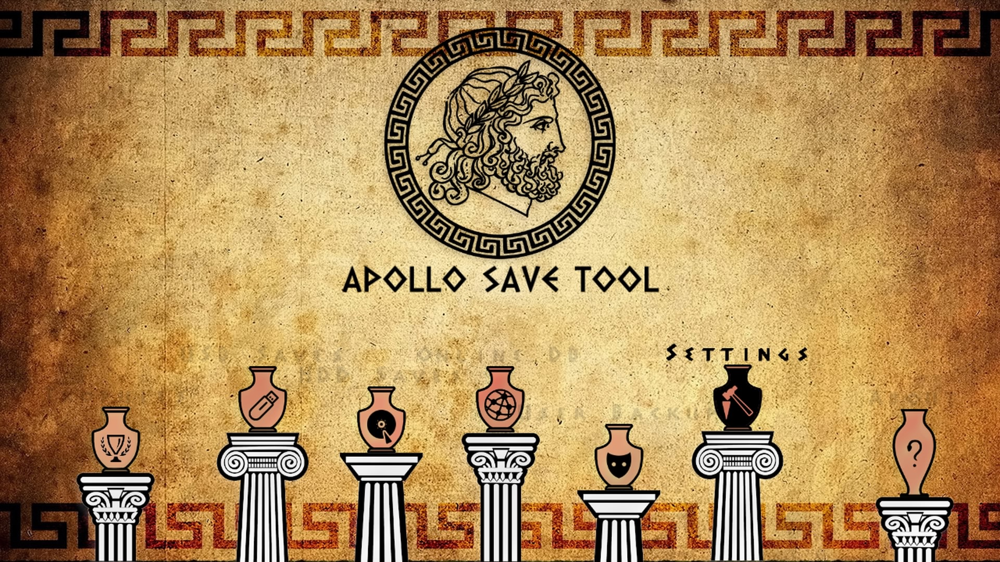
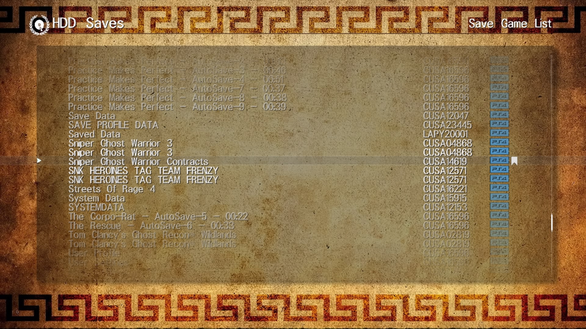
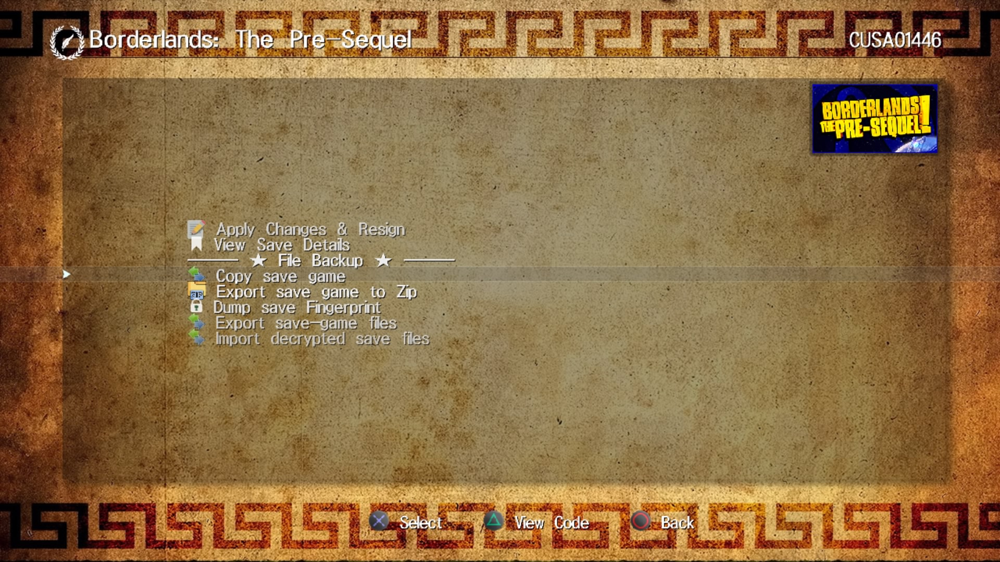
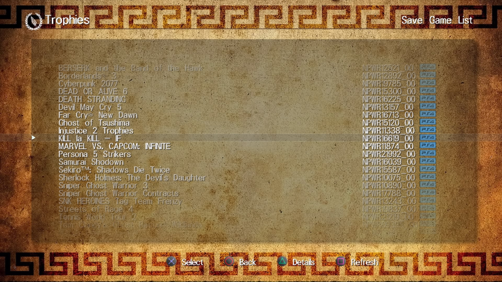
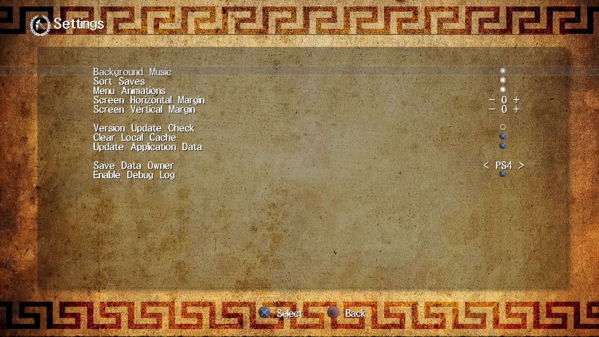

# Apollo Save Tool (PS4)

[![Downloads][img_downloads]][app_downloads] [![Release][img_latest]][app_latest] [![License][img_license]][app_license]
[](https://github.com/bucanero/apollo-ps4/actions/workflows/build.yml)

[](https://twitter.com/dparrino)
[](https://deepwiki.com/bucanero/apollo-ps4)

**Apollo Save Tool** is an application to manage save-game files on the PlayStation 4.

This homebrew app allows you to download, unlock, patch, and resign save-game files directly on your PS4.



<details>
<summary>Screenshots Gallery (Click to Expand)</summary>


---

---

---

---


</details>

**Comments, ideas, suggestions?** You can [contact me](https://github.com/bucanero/) on [Twitter](https://twitter.com/dparrino) and on [my website](http://www.bucanero.com.ar/).

# Features

* **Easy to use:** no save-mount patches or advanced setup needed.
* **Standalone:** no computer required, everything happens on the PS4.
* **Automatic settings:** auto-detection of PS4 firmware, User ID, and Account-ID settings.
* **Multi-user:** supports multiple user accounts.
* **Localization support:** English, French, Greek, German, Italian, Japanese, Portuguese, Russian, Spanish.

## Save Management

* **Save files listing:** quick access to all the save files on USB and the internal PS4 HDD (+ file details)
* **Save param.sfo updating:** allows the user to update the `param.sfo` User ID and Account ID information.
* **Save files patching:** complete support for Save Wizard and [Bruteforce Save Data](https://bruteforcesavedata.forumms.net/) cheat patches to enhance your save-games.
* **Save import/export:** allows the user to decrypt and export save files, and import decrypted saves from other consoles.
* **Save downloading:** easy access to an Online Database of save-game files to download straight to your PlayStation.

## Trophy Management

* **Trophy container mounting:** allows to mount secure `trophy.img` files for the current user.
* **Trophy Set exporting:** easy backup of trophy files to `.zip` and raw formats.
* **Trophy lock/unlock:** fake lock/unlock trophies (XMB only).

## Account Management

* **Account activation:** create fake Account IDs and generate offline PS4 activations
* **Recover passcode:** simple recovery method for the Parental Security Passcode.

## PS1 Virtual Memory Card Management

* **VMC saves management:** quick access to all save files on Virtual Memory Cards images.
  - Supported PS1 VMC formats: `.VMP`, `.MCR`, `.VM1`, `.BIN`, `.VMC`, `.GME`, `.VGS`, `.SRM`, `.MCD`
* **Import PS1 saves:** import saves to VMCs from other systems and consoles (`.MCS`, `.PSV`, `.PSX`, `.PS1`, `.MCB`, `.PDA` supported).
* **Export PS1 saves:** allows the user export saves on VMC images to `.MCS`/`.PSV`/`.PSX` formats.

## PS2 Virtual Memory Card Management

* **VMC saves management:** quick access to all save files on Virtual Memory Cards images.
  - Supported PS2 VMC formats: `.VM2`, `.CARD`, `.PS2`, `.VMC`, `.BIN`, `.MC2`, `.MCD`
  - Supports ECC and non-ECC images
* **Import PS2 saves:** import saves to VMCs from other systems and consoles (`.PSU`, `.PSV`, `.XPS`, `.CBS`, `.MAX`, `.SPS` supported).
* **Export PS2 saves:** allows the user export saves on VMC images to `.PSU` and `.PSV` formats

# Download

Get the [latest version here][app_latest].

<details>
<summary>Nightly Builds (Click to Expand)</summary>

- Login to GitHub [(this is required to download artifacts)](https://docs.github.com/en/actions/managing-workflow-runs/downloading-workflow-artifacts#:~:text=Who%20can%20use,download%20workflow%20artifacts.).
- Click on a build in the **[Actions](../../actions)** Tab.
  - 
- Click on the artifact to download the pkg zip.
  - 

</details>

## Changelog

See the [latest changes here](CHANGELOG.md).

# Donations

My GitHub projects are open to a [sponsor program](https://patreon.com/dparrino). If you feel that my tools helped you in some way or you would like to support it, you can consider a [PayPal donation](https://www.paypal.me/bucanerodev).

# Setup instructions

No special setup is needed. Just download the latest [`IV0000-APOL00004_00-APOLLO0000000PS4.pkg`](https://github.com/bucanero/apollo-ps4/releases/latest/download/IV0000-APOL00004_00-APOLLO0000000PS4.pkg) package and install it on your PlayStation 4.
On first run, the application will detect and setup the required user settings.

## Data folders

### PS4

| PS4 | Folder |
|-----|--------|
| **USB saves** | your decrypted saves must be placed on `/mnt/usbX/PS4/APOLLO/`. |
| **USB saves** | encrypted saves must be placed on `/mnt/usbX/PS4/SAVEDATA/<account-id>/`. |
| **External saves (HDD)** | your decrypted saves must be placed on `/data/fakeusb/PS4/APOLLO/`. |
| **External saves (HDD)** | encrypted saves must be placed on `/data/fakeusb/PS4/SAVEDATA/<account-id>/`. |
| **HDD saves** | files will be scanned from the hard disk, based on the current `User ID`. |

### PS2

| PS2 | Folder |
|-----|--------|
| **USB saves** | `/mnt/usbX/PS2/SAVEDATA/` (`*.xps`, `*.max`, `*.psu`, `*.cbs`, `*.psv`, `*.sps`) |
| **VMC cards** | `/mnt/usbX/PS2/VMC/` (`*.vmc`, `*.card`, `*.vm2`, `*.ps2`, `*.bin`, `*.mc2`, `*.mcd`) |
| **PSV saves** | `/mnt/usbX/PS3/EXPORT/PSV/` |
| **External saves (HDD)** | `/data/fakeusb/PS2/SAVEDATA/` |
| **External VMCs (HDD)** | `/data/fakeusb/PS2/VMC/` |
| **HDD VMC cards** | VMCs will be scanned from PS4 saves on the hard disk |

### PS1

| PS1 | Folder |
|-----|--------|
| **USB saves** | `/mnt/usbX/PS1/SAVEDATA/` (`*.mcs`, `*.psx`, `*.ps1`, `*.mcb`, `*.psv`, `*.pda`) |
| **VMC cards** | `/mnt/usbX/PS1/VMC/` (`*.vmc`, `*.mcd`, `*.mcr`, `*.gme`, `*.vm1`, `*.vmp`, `*.vgs`, `*.srm`, `*.bin`) |
| **PSV saves** | `/mnt/usbX/PS3/EXPORT/PSV/` |
| **External saves (HDD)** | `/data/fakeusb/PS1/SAVEDATA/` |
| **External VMCs (HDD)** | `/data/fakeusb/PS1/VMC/` |
| **HDD VMC cards** | VMCs will be scanned from PS4 saves on the hard disk |

## Offline Account activation

To activate an account offline, go to the `User Tools` menu, and select `Activate PS4 Accounts`.
By default the local account will be activated with an auto-generated `account-id` value.
This default account value can be edited using the on-screen keyboard.

# Usage

Using the application is simple and straight-forward:

 - Move <kbd>UP</kbd>/<kbd>DOWN</kbd> to select the save-game file you want to patch, and press . The patch screen will show the available fixes for the file. Select the patches and click `Apply`.
 - To view the item's details, press .
It will open the context menu on the screen. Press  to return to the list.
 - To reload the list, press .
 - Press <kbd>L1</kbd>/<kbd>L2</kbd> or <kbd>R1</kbd>/<kbd>R2</kbd> trigger buttons to move pages up or down.

# Online Database

The application also provides direct access to the [Apollo online database](https://github.com/bucanero/apollo-saves) of save-game files for PlayStation 4 games. These usually offer additional features such as completed games that can save you many hours of playing.

Currently, the list of available games and files is limited, but the project aims to add more save-games shared by the community.

**Note:** Downloaded save files **must be resigned** using Apollo before loading them in your games.

# FAQs

 1. Where I can get a save-game for *XYZ game*?
    
    You can check sites like [Brewology.com](https://ps3.brewology.com/gamesaves/savedgames.php?page=savedgames&system=ps4), and [GameFAQs](https://gamefaqs.gamespot.com/ps4/). Also, searching on [Google](http://www.google.com) might help.
 1. I have a save-game file that I want to share. How can I upload it?
    
    If you have a save file that is not currently available on the Online Database and want to share it, please check [this link](https://github.com/bucanero/apollo-saves) for instructions.
 1. Why is it called **Apollo**?
    
    [Apollo](https://en.wikipedia.org/wiki/Apollo) was the twin brother of [Artemis](https://en.wikipedia.org/wiki/Artemis), goddess of the hunt. Since this project was born using the [Artemis-GUI](https://github.com/Dnawrkshp/ArtemisPS3/) codebase, I decided to respect that heritage by calling it Apollo.

# Credits

* [Bucanero](https://github.com/bucanero): [Project developer](https://bucanero.github.io/apollo-ps4/)

## Acknowledgments

* [Dnawrkshp](https://github.com/Dnawrkshp/): [Artemis PS3](https://github.com/Dnawrkshp/ArtemisPS3)
* [hzh](https://github.com/hzhreal)/[Team-Alua](https://github.com/Team-Alua/cecie.nim): [vsh-utils](https://github.com/hzhreal/PS4-vsh-utils)
* [Berion](https://www.psx-place.com/members/berion.1431/): GUI design
* [flatz](https://github.com/flatz): [SFO tools](https://github.com/bucanero/pfd_sfo_tools/)
* [aldostools](https://aldostools.org/): [Bruteforce Save Data](https://bruteforcesavedata.forumms.net/)
* [jimmikaelkael](https://github.com/jimmikaelkael): ps3mca tool
* [ShendoXT](https://github.com/ShendoXT): [MemcardRex](https://github.com/ShendoXT/memcardrex)
* [Nobody/Wild Light](https://github.com/nobodo): [Background music track](https://github.com/bucanero/apollo-vita/blob/main/data/haiku.s3m)

## Translators

Apollo supports multiple languages for its user interface. Thanks to the following contributors for their help with translations:

- [Akela](https://x.com/Akela_1979) (Russian), Algol (French), [Bucanero](https://github.com/bucanero) (Spanish), [TheheroGAC](https://x.com/TheheroGAC) (Italian), [yyoossk](https://x.com/Cloud0835) (Japanese), [Phoenixx1202](https://github.com/Phoenixx1202) (Portuguese), [Gabor Sari](https://github.com/oldman63) (Hungarian), SpyroMancer (Greek), [SoftwareRat](https://github.com/SoftwareRat) (German)

# Building

You need to have installed:

- [Open Orbis SDK](https://github.com/OpenOrbis/OpenOrbis-PS4-Toolchain/)
- [Apollo](https://github.com/bucanero/apollo-lib) library
- [polarSSL](https://github.com/bucanero/oosdk_libraries/tree/master/polarssl-1.3.9) library
- [cURL](https://github.com/bucanero/oosdk_libraries/tree/master/curl-7.64.1) library
- [libZip](https://github.com/bucanero/oosdk_libraries/tree/master/libzip-1.9.2) library
- [SDL2](https://github.com/PacBrew/SDL/tree/ps4) library
- [libJbc](https://github.com/bucanero/ps4-libjbc) library
- [libs3m](https://github.com/bucanero/s3mplay) library
- [libSQLite](https://github.com/bucanero/libSQLite-ps4) library
- [Mini-XML](https://github.com/bucanero/mxml) library
- [mini18n](https://github.com/bucanero/mini18n) library
- [dbglogger](https://github.com/bucanero/dbglogger) library

> [!TIP]
> **Developers:** You can find detailed technical documentation about the project in [this Wiki page](https://deepwiki.com/bucanero/apollo-ps4/).

Run `make` to create a release build. If you want to include the latest save patches in your `.pkg` file, run `make createzip`.

You can also set the `PS3LOAD` environment variable to your PS4 IP address: `export PS3LOAD=tcp:x.x.x.x`.
This will allow you to use a [ps3load client](https://github.com/bucanero/ps4load/tree/main/client) and send the `eboot.bin` directly to the [PS4Load listener](https://github.com/bucanero/ps4load).

To enable debug logging, build Apollo Save Tool with `make DEBUGLOG=1`. The application will send debug messages to
UDP multicast address `239.255.0.100:30000`. To receive them you can use [socat][] on your computer:

```sh
$ socat udp4-recv:30000,ip-add-membership=239.255.0.100:0.0.0.0 -
```

# License

[Apollo Save Tool](https://github.com/bucanero/apollo-ps4/) (PS4) - Copyright (C) 2020-2025 [Damian Parrino](https://twitter.com/dparrino)

This program is free software: you can redistribute it and/or modify
it under the terms of the [GNU General Public License][app_license] as published by
the Free Software Foundation, either version 3 of the License, or
(at your option) any later version.

[socat]: http://www.dest-unreach.org/socat/
[app_downloads]: https://github.com/bucanero/apollo-ps4/releases
[app_latest]: https://github.com/bucanero/apollo-ps4/releases/latest
[app_license]: https://github.com/bucanero/apollo-ps4/blob/master/LICENSE
[img_downloads]: https://img.shields.io/github/downloads/bucanero/apollo-ps4/total.svg?maxAge=3600
[img_latest]: https://img.shields.io/github/release/bucanero/apollo-ps4.svg?maxAge=3600
[img_license]: https://img.shields.io/github/license/bucanero/apollo-ps4.svg?maxAge=2592000
