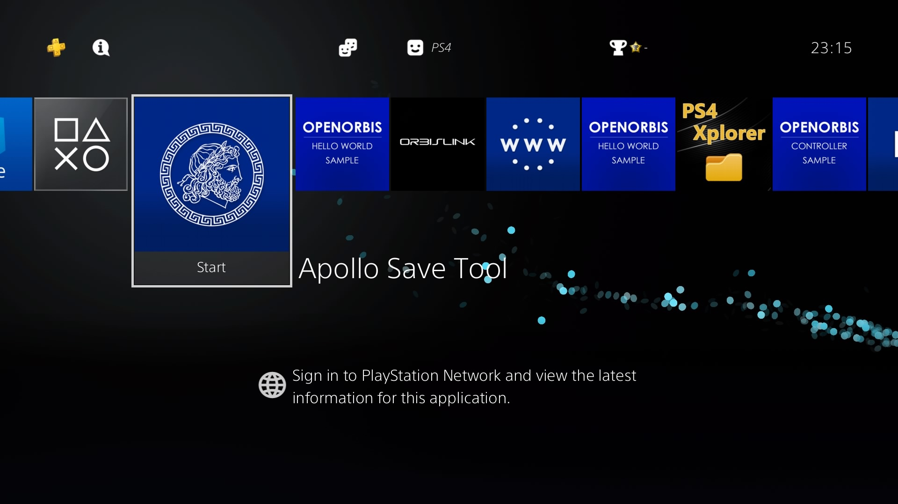

# Apollo Save Tool (PS4)

[![Downloads][img_downloads]][app_downloads] [![Release][img_latest]][app_latest] [![License][img_license]][app_license]

**Apollo Save Tool** is an application to manage save-game files on the PlayStation 4.

This homebrew app allows you to download, unlock, patch, and resign save-game files directly on your PS4.

Screenshots Gallery (Click to Expand)

---

---

---

---

**Comments, ideas, suggestions?** You can [contact me](https://github.com/bucanero/) on [Twitter](https://twitter.com/dparrino) and on [my website](http://www.bucanero.com.ar/).

# Features

* **Easy to use:** no save-mount patches or advanced setup needed.
* **Standalone:** no computer required, everything happens on the PS4.
* **Automatic settings:** auto-detection of PS4 firmware, User ID, and Account-ID settings.
* **Multi-user:** supports multiple user accounts.

## Save Management

* **Save files listing:** quick access to all the save files on USB and the internal PS4 HDD (+ file details)
* **Save param.sfo updating:** allows the user to update the `param.sfo` User ID and Account ID information.
* **Save files patching:** complete support for Save Wizard and [Bruteforce Save Data](https://bruteforcesavedata.forumms.net/) cheat patches to enhance your save-games.
* **Save import/export:** allows the user to decrypt and export save files, and import decrypted saves from other consoles.
* **Save downloading:** easy access to an Online Database of save-game files to download straight to your PlayStation.

## Trophy Management

* **Trophy container mounting:** allows to mount secure `trophy.img` files for the current user.
* **Trophy Set exporting:** easy backup of trophy files to `.zip` and raw formats.
* **Trophy lock/unlock:** fake lock/unlock trophies (XMB only).

## Account Management

* **Account activation:** create fake Account IDs and generate offline PS4 activations
* **Recover passcode:** simple recovery method for the Parental Security Passcode.

## PS1 Virtual Memory Card Management

* **VMC saves management:** quick access to all save files on Virtual Memory Cards images.
  - Supported PS1 VMC formats: `.VMP`, `.MCR`, `.VM1`, `.BIN`, `.VMC`, `.GME`, `.VGS`, `.SRM`, `.MCD`
* **Import PS1 saves:** import saves to VMCs from other systems and consoles (`.MCS`, `.PSV`, `.PSX`, `.PS1`, `.MCB`, `.PDA` supported).
* **Export PS1 saves:** allows the user export saves on VMC images to `.MCS`/`.PSV`/`.PSX` formats.

## PS2 Virtual Memory Card Management

* **VMC saves management:** quick access to all save files on Virtual Memory Cards images.
  - Supported PS2 VMC formats: `.VM2`, `.CARD`, `.PS2`, `.VMC`, `.BIN`
  - Supports ECC and non-ECC images
* **Import PS2 saves:** import saves to VMCs from other systems and consoles (`.PSU`, `.PSV`, `.XPS`, `.CBS`, `.MAX`, `.SPS` supported).
* **Export PS2 saves:** allows the user export saves on VMC images to `.PSU` and `.PSV` formats

# Download

Get the [latest version here][app_latest].

Nightly Builds (Click to Expand)

- Login to GitHub [(this is required to download artifacts)](https://docs.github.com/en/actions/managing-workflow-runs/downloading-workflow-artifacts#:~:text=Who%20can%20use,download%20workflow%20artifacts.).
- Click on a build in the **[Actions](../../actions)** Tab.
  - 
- Click on the artifact to download the pkg zip.
  - 

## Changelog

See the [latest changes here](CHANGELOG.md).

# Donations

My GitHub projects are open to a [sponsor program](https://patreon.com/dparrino). If you feel that my tools helped you in some way or you would like to support it, you can consider a [PayPal donation](https://www.paypal.me/bucanerodev).

# Setup instructions

No special setup is needed. Just download the latest [`IV0000-APOL00004_00-APOLLO0000000PS4.pkg`](https://github.com/bucanero/apollo-ps4/releases/latest/download/IV0000-APOL00004_00-APOLLO0000000PS4.pkg) package and install it on your PlayStation 4.
On first run, the application will detect and setup the required user settings.

## Data folders

### PS4

| PS4 | Folder |
|-----|--------|
| **USB saves** | your decrypted saves must be placed on `/mnt/usbX/PS4/APOLLO/`. |
| **USB saves** | encrypted saves must be placed on `/mnt/usbX/PS4/SAVEDATA/<account-id>/`. |
| **External saves (HDD)** | your decrypted saves must be placed on `/data/fakeusb/PS4/APOLLO/`. |
| **External saves (HDD)** | encrypted saves must be placed on `/data/fakeusb/PS4/SAVEDATA/<account-id>/`. |
| **HDD saves** | files will be scanned from the hard disk, based on the current `User ID`. |

### PS2

| PS2 | Folder |
|-----|--------|
| **USB saves** | `/mnt/usbX/PS2/SAVEDATA/` (`*.xps`, `*.max`, `*.psu`, `*.cbs`, `*.psv`, `*.sps`) |
| **VMC cards** | `/mnt/usbX/PS2/VMC/` (`*.vmc`, `*.card`, `*.vm2`, `*.ps2`, `*.bin`) |
| **PSV saves** | `/mnt/usbX/PS3/EXPORT/PSV/` |
| **External saves (HDD)** | `/data/fakeusb/PS2/SAVEDATA/` |
| **External VMCs (HDD)** | `/data/fakeusb/PS2/VMC/` |
| **HDD VMC cards** | VMCs will be scanned from PS4 saves on the hard disk |

### PS1

| PS1 | Folder |
|-----|--------|
| **USB saves** | `/mnt/usbX/PS1/SAVEDATA/` (`*.mcs`, `*.psx`, `*.ps1`, `*.mcb`, `*.psv`, `*.pda`) |
| **VMC cards** | `/mnt/usbX/PS1/VMC/` (`*.vmc`, `*.mcd`, `*.mcr`, `*.gme`, `*.vm1`, `*.vmp`, `*.vgs`, `*.srm`, `*.bin`) |
| **PSV saves** | `/mnt/usbX/PS3/EXPORT/PSV/` |
| **External saves (HDD)** | `/data/fakeusb/PS1/SAVEDATA/` |
| **External VMCs (HDD)** | `/data/fakeusb/PS1/VMC/` |
| **HDD VMC cards** | VMCs will be scanned from PS4 saves on the hard disk |

## Offline Account activation

To activate an account offline, go to the `User Tools` menu, and select `Activate PS4 Accounts`.
By default the local account will be activated with an auto-generated `account-id` value.
This default account value can be edited using the on-screen keyboard.

# Usage

Using the application is simple and straight-forward:

 - Move <kbd>UP</kbd>/<kbd>DOWN</kbd> to select the save-game file you want to patch, and press . The patch screen will show the available fixes for the file. Select the patches and click `Apply`.
 - To view the item's details, press .
It will open the context menu on the screen. Press  to return to the list.
 - To reload the list, press .
 - Press <kbd>L1</kbd>/<kbd>L2</kbd> or <kbd>R1</kbd>/<kbd>R2</kbd> trigger buttons to move pages up or down.

# Online Database

The application also provides direct access to the [Apollo online database](https://github.com/bucanero/apollo-saves) of save-game files for PlayStation 4 games. These usually offer additional features such as completed games that can save you many hours of playing.

Currently, the list of available games and files is limited, but the project aims to add more save-games shared by the community.

**Note:** Downloaded save files **must be resigned** using Apollo before loading them in your games.

# FAQs

 1. Where I can get a save-game for *XYZ game*?
    
    You can check sites like [Brewology.com](https://ps3.brewology.com/gamesaves/savedgames.php?page=savedgames&system=ps4), and [GameFAQs](https://gamefaqs.gamespot.com/ps4/). Also, searching on [Google](http://www.google.com) might help.
 1. I have a save-game file that I want to share. How can I upload it?
    
    If you have a save file that is not currently available on the Online Database and want to share it, please check [this link](https://github.com/bucanero/apollo-saves) for instructions.
 1. Why is it called **Apollo**?
    
    [Apollo](https://en.wikipedia.org/wiki/Apollo) was the twin brother of [Artemis](https://en.wikipedia.org/wiki/Artemis), goddess of the hunt. Since this project was born using the [Artemis-GUI](https://github.com/Dnawrkshp/ArtemisPS3/) codebase, I decided to respect that heritage by calling it Apollo.

# Credits

* [Bucanero](http://www.bucanero.com.ar/): [Project developer](https://github.com/bucanero)

## Acknowledgments

* [Dnawrkshp](https://github.com/Dnawrkshp/): [Artemis PS3](https://github.com/Dnawrkshp/ArtemisPS3)
* [hzh](https://github.com/hzhreal)/[Team-Alua](https://github.com/Team-Alua/cecie.nim): [vsh-utils](https://github.com/hzhreal/PS4-vsh-utils)
* [Berion](https://www.psx-place.com/members/berion.1431/): GUI design
* [flatz](https://github.com/flatz): [SFO tools](https://github.com/bucanero/pfd_sfo_tools/)
* [aldostools](https://aldostools.org/): [Bruteforce Save Data](https://bruteforcesavedata.forumms.net/)
* [jimmikaelkael](https://github.com/jimmikaelkael): ps3mca tool
* [ShendoXT](https://github.com/ShendoXT): [MemcardRex](https://github.com/ShendoXT/memcardrex)
* [Nobody/Wild Light](https://github.com/nobodo): [Background music track](https://github.com/bucanero/apollo-vita/blob/main/data/haiku.s3m)

# Building

You need to have installed:

- [Open Orbis SDK](https://github.com/OpenOrbis/OpenOrbis-PS4-Toolchain/)
- [Apollo](https://github.com/bucanero/apollo-lib) library
- [polarSSL](https://github.com/bucanero/oosdk_libraries/tree/master/polarssl-1.3.9) library
- [cURL](https://github.com/bucanero/oosdk_libraries/tree/master/curl-7.64.1) library
- [libZip](https://github.com/bucanero/oosdk_libraries/tree/master/libzip-1.9.2) library
- [SDL2](https://github.com/PacBrew/SDL/tree/ps4) library
- [libJbc](https://github.com/bucanero/ps4-libjbc) library
- [libs3m](https://github.com/bucanero/s3mplay) library
- [libSQLite](https://github.com/bucanero/libSQLite-ps4) library
- [Mini-XML](https://github.com/bucanero/mxml) library
- [dbglogger](https://github.com/bucanero/dbglogger) library

Run `make` to create a release build. If you want to include the latest save patches in your `.pkg` file, run `make createzip`.

You can also set the `PS3LOAD` environment variable to your PS4 IP address: `export PS3LOAD=tcp:x.x.x.x`.
This will allow you to use a [ps3load client](https://github.com/bucanero/ps4load/tree/main/client) and send the `eboot.bin` directly to the [PS4Load listener](https://github.com/bucanero/ps4load).

To enable debug logging, build Apollo Save Tool with `make DEBUGLOG=1`. The application will send debug messages to
UDP multicast address `239.255.0.100:30000`. To receive them you can use [socat][] on your computer:

    $ socat udp4-recv:30000,ip-add-membership=239.255.0.100:0.0.0.0 -

# License

[Apollo Save Tool](https://github.com/bucanero/apollo-ps4/) (PS4) - Copyright (C) 2020-2024 [Damian Parrino](https://twitter.com/dparrino)

This program is free software: you can redistribute it and/or modify
it under the terms of the [GNU General Public License][app_license] as published by
the Free Software Foundation, either version 3 of the License, or
(at your option) any later version.

[socat]: http://www.dest-unreach.org/socat/
[app_downloads]: https://github.com/bucanero/apollo-ps4/releases
[app_latest]: https://github.com/bucanero/apollo-ps4/releases/latest
[app_license]: https://github.com/bucanero/apollo-ps4/blob/master/LICENSE
[img_downloads]: https://img.shields.io/github/downloads/bucanero/apollo-ps4/total.svg?maxAge=3600
[img_latest]: https://img.shields.io/github/release/bucanero/apollo-ps4.svg?maxAge=3600
[img_license]: https://img.shields.io/github/license/bucanero/apollo-ps4.svg?maxAge=2592000

# Usage Instructions
# NOTICE you must have a fake activated account or already have a real PSN account on the console to use saves from other users and properly export savedata. 
* See `Activating offline profiles` on how to do it by using your real PSN ID or allow Apollo to create one.

# Title ID, User ID and Account ID 
## What is a Title ID 
* The product code is distinct to a region, and the common codes you’ll see are CUSA, PCAS, and PLAS.  
R1 USA-CUSA        
R2 Europe-CUSA     
R3 Asia-PLAS, PCAS        
   
The product code is followed by a 5 digit unique number identifier.      
The Title ID is the Product code along with the unique numerical identifier of the game.     
* For example Minecraft USA is CUSA00744 while Minecraft EU is CUSA00265    
* Another example Resident Evil 2, USA is CUSA09193 while Asia is PLAS10335   
* The majority of games you come across will use CUSA.    

## What is a User-ID 
The user ID is the internal description for the local user account. (Example - 11cd8de)

## What is an Account-ID
The Account ID a PSN ID assigned to the local user. (Example - abcdef01234556789) but must be 16 hex characters.
* To see yours and active your offline console's user account with it or to generate a fake one for fake activation read below.

# Activating offline profiles
* You can offline activate your local account on a jailbroken console to either match your legitimate PSN Account ID which will allow you to directly transfer save files via USB with no need for Save Wizard. 
* Or activate a local account for use with chiaki and and proper savedata management.
## To fake activate the account and make it match your PSN Account ID and use your PSN saves and chiaki 
1. On a console that has your legitimate PSN account copy a save file to a USB Drive.
2. Plug in the USB Drive into a PC
* On the USB you will find the following folder path.
* `PS4/SAVEDATA/abcdef01234556789/CUSAxxxxx`
* abcdef01234556789 (is an example here) but for you the one you see there is your PSN account ID take note of it for later 
3. Open Apollo Save Tool, navigate to User Tools.
4. Select Activate PS4 Accounts.
5. Select your profile.
6. Select the account you want to activate and press X.
7. A string of letters and numbers will show up you can replace them with the PSN account ID you got earlier.
8. Then press R2 then X and then keep pressing O till you are asked if you want to exit to the XMB accept then restart the console or sign out and back in.
9. Any saves you have can now be transferred via USB to a legit console as long as the title id matches and the game version is the same or higher.

## To fake activate for use with chiaki and general save management 
* Ignore if you have done the above option and already have an activated account go to Getting the ID needed for Chiaki if needed.
1. Open Apollo Save Tool, navigate to User Tools.
2. Select Activate PS4 Accounts.
3. Select your profile.
4. Select the account you want to activate and press X.
5. A string of letters and numbers will show up copy them CORRECTLY then press R2 then X and then keep pressing O till you are asked if you want to exit to the XMB accept then restart the console
*(the string can be found in About in Apollo Save Tool incase you lose it)

## Getting the ID needed for Chiaki
* This works for both the PSN account ID activated profile and for a normal Apollo fake activated account.   
1. You will take your Account-ID and convert it on the website below.    
* Already loaded here > https://trinket.io/embed/python3/ba2ff26973    
3. Once you are ready to run the code paste the string of the ACCOUNT-ID (example > abcdef01234556789) in the user_id = "here" between the 2 "" as seen in the code then run it. (ignore that it is named user-id in the script it is the account-id)
4. You will then receive a new string of letters and numbers (example > CN8aubEclS6=) you can then use that with chiaki to use remote play or continue to utilise the offline activated account for savedata management.

# Getting saves and or managing them 
There are many ways to download or manage savedata here are some of the easiest ways.   
## Online database  
The online database is a ever growing collection of save files for PS2, PS3 & PS4 games. Users can submit their own save files too.
1. Simply navigate to online database section, select your game, and download to a USB drive or to your internal HDD.
2. Navigate to either USB saves or HDD saves, depending on where you chose to save them.
* If you selected HDD saves, check to see if they appear in the HDD saves section.
* If you selected USB saves, navigate to USB Saves and select `Copy save game` to HDD.

## Copying saves between multiple profiles
This is useful if you have multiple accounts like User1, User2 etc.
1. Simply navigate to HDD saves  `Copy save game` and select to USB.
2. Log in to your secondary profile.
3. Navigate to USB  and select `Copy save game` and select the HDD.

## Managing your Decrypted save data 
1. You can export and import decrypted savedata by using the option `Copy save game` in Apollo. Or the Export/Import Decrypted save files options but they send the data to the internal drive. Or the Export to Zip option.
2. When using the `Copy save game` option Apollo copies decrypted savadata to the following path
*  `/PS4/APOLLO/ <USER-ID><title-id><Save-name`       
with files and a sce_sys folder inside.   
3. When importing it not needed for the folder path to end with  
* `<USER-ID><title-id><Save-name` the `title-id` is enough.      
But a proper structure with savedata and a sce_sys folder is needed.
4. When you decrypt a save file you are then one step closer to editing it if tools or documented methods exist for the specific game.
To copy it back to the HDD later select `Copy save game` and select the HDD.

## Managing Encrypted save data tied to your account
You can import and export savadata by using the Application Saved Data Management option in Settings on the PS4.
* This exports encrypted saves signed to the account id of the user exporting them and can usually only be used on the same user even on a different console unless Apollo or Save Wizard are used.
* To use your savedata on a jailbroken and retail console see Activating offline profiles. Otherwise export and import as needed. Using the option `Copy save game` or `Export save game to Zip` in Apollo and backing it up to a USB is suggested as it gives you decrypted savedata.

## Managing Encrypted savedata acquired online
Encrypted saves are saves made from retail/unjailbroken PS4s made via Account Data Management feature or come from Save Wizard. 
* Note that Save Wizard is not needed. 
* Note that the saves must be from 11.00 or lower.
1. On a USB drive formatted as exFAT, put the saves in the following structure: `/PS4/SAVEDATA/ <ACCOUNT-ID> / <title-id` and inside the ACCOUNT-ID should be a folder with the title id of the game CUSAxxxxx and inside it the save files.
* The ACCOUNT-ID can be  `0000000000000000` or `abcdef01234556789` or any 16 hex characters. 
* The title-id is that of the game for example `CUSA09193`. 
2. Back to the PS4, open the game the save was made for, and make a brand new save. 
3. Open Apollo Save Tool.
4. Navigate to USB Saves. Select the save.
5. Select copy to HDD. Select yes to resign it.
6. Check to see if the save is present in HDD Saves.
* Note sometimes save files may display a ??? firmware warning in this case try the following.
7. Delete all savedata of the game on the HDD and create new savedata.
8. Export it via the Account Data Management feature from settings. Or for decrypted data `Copy save game` to USB.
9. Compare the online savedata names and make it match the one you just got from the console then try again.

## Managing Decrypted savedata acquired online
Decrypted saves are usually your own but sometimes are shared online.
* Note that Save Wizard is not needed. 
* Note that the saves must be from 11.00 or lower.
* If the save file you have has a sce_sys folder with a keystone and param.sfo
1. Put it in the following path on a USB drive formatted as exFAT `/PS4/APOLLO/<title-id` and in Apollo go to USB saves choose the `Copy save game` option and copy it to the HDD.
* If the save file is a file on it's own.
2. Plug in a USB drive formatted as exFAT into the PS4.
3. You will need to create a save in the game and then from Apollo in HDD saves use the `Copy save game` to copy the savedata to the USB.
4. Then in this path on the USB `/PS4/APOLLO/<USER-ID><title-id><Save-name` find and replace the file inside with the file you alread have then back in Apollo in USB saves use the `Copy save game` option and copy it to the HDD.

## Managing save files from different CUSA IDs
This is a fix if you want to make use of files that are for the same game but different CUSA IDs or versions (such as standard vs deluxe/GOTY editions).
1. On the game you want the save to be applied to, make a new save.
2. Open Apollo Save Tool, select HDD saves. Select your save and select Export decrypted save files. Export all the files one by one.
3. Open PS4Xplorer, navigate to `/data/apollo/yourprofileid/` and simply rename the folder of the CUSA ID to the version of the game you need to have the game to.
4. Back to Apollo Save Tool, select HDD saves. Select your new game title ID, select Import decrypted save files. Import them one by one. Select Apply Changes & Resign.
5. Open your game. You should see the same name as before, but a different size or at a different point in the game.

## Fixing Keystone issues with savedata 
*Assuming the title id of the game or game version are not the issue sometimes you may do everything right but savedata always shows as corrupted. 
*This usually means the game you have or the game the save came from does not have a matching keystone this is usually an issue with dumped games as they are not rebuilt with the original keystone.
1. To fix this export the keystone from an already working save file and import it into the save file that you want to fix then copy the save file to the HDD and try it out.

# I rebuilt my database and now all my homebrew and games are gone how do i get them back?
1. Download the latest version Apollo Save Tool and put it in the root of a USB drive ( Has to be formatted in Exfat) then plug it into your PS4. 
2. Jailbreak your console as you usually do.
3. In GoldHEN Debug Settings before entering the Package Installer under it are some options make sure Enable Background Installation is NOT enabled.
4. Install Apollo and select yes to reinstall it if it asks you to ( This happens only if it was previously installed)
5. Open Apollo Save Tool and go to User Tools.
6. Then select App.db Database Management.
7. There you can select Rebuild App.db Database (Restore missing XMB items) and you can also select Rebuild DLC Database (addcont.db)
8. Then close Apollo and log out of and log in the user account for everything to properly show up.
* If you cannot see the games and apps on the home screen check in the PS4 Library App.
* Optionally you can then create a backup of your current database to use in the future with the restore option.
* NOTICE restoring a database backup when the original users are not present or new ones have been added can cause issues. 